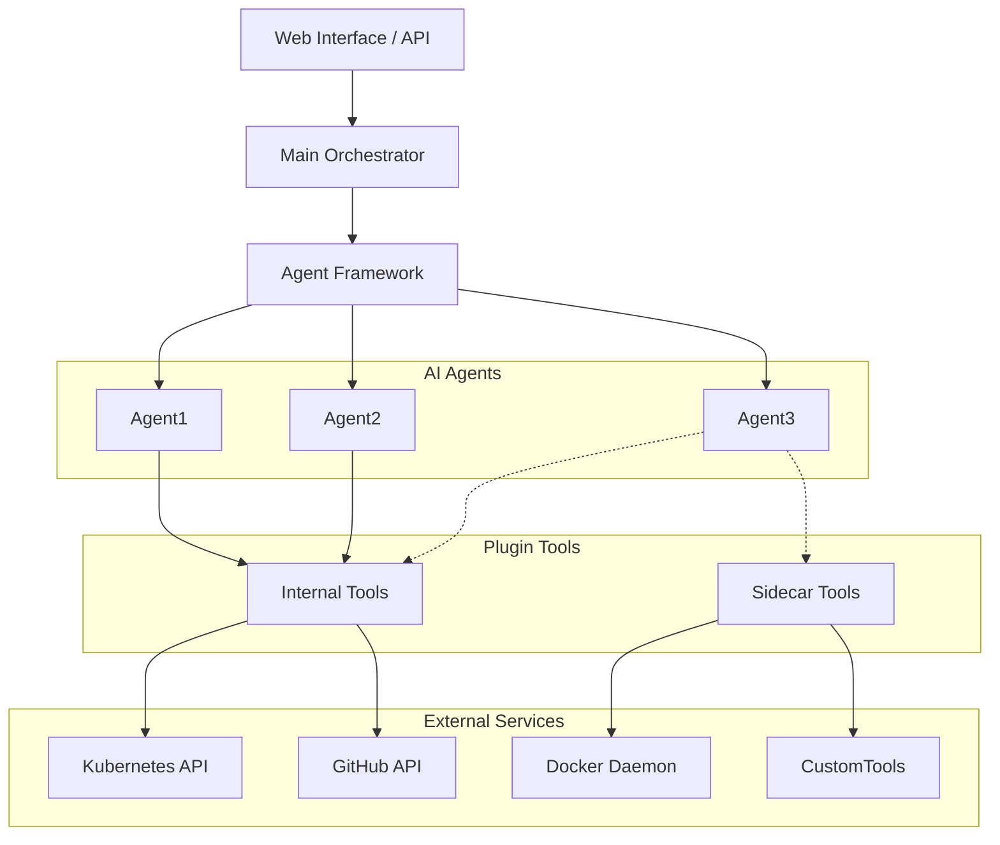

### High Level Design

```mermaid
graph TB
    UI[Web Interface / API]
    MainOrch[Main Orchestrator]
    AgentFramework[Agent Framework]

    subgraph "AI Agents"
        Agent1[Agent1]
        Agent2[Agent2]
        CustomAgent[Agent3]
    end

    subgraph "Plugin Tools"
        Internal[Internal Tools]
        Sidecar[Sidecar Tools]
    end

    subgraph "External Services"
        K8sAPI[Kubernetes API]
        GitAPI[GitHub API]
        DockerAPI[Docker Daemon]
        CustomTools[CustomTools]
    end

    UI --> MainOrch
    MainOrch --> AgentFramework
    AgentFramework --> Agent1
    AgentFramework --> Agent2
    AgentFramework --> CustomAgent

    Agent1 --> Internal

    Agent2 --> Internal
    CustomAgent -.-> Internal
    CustomAgent -.-> Sidecar

    Internal --> K8sAPI
    Internal --> GitAPI
    Sidecar --> DockerAPI
    Sidecar --> CustomTools
```
