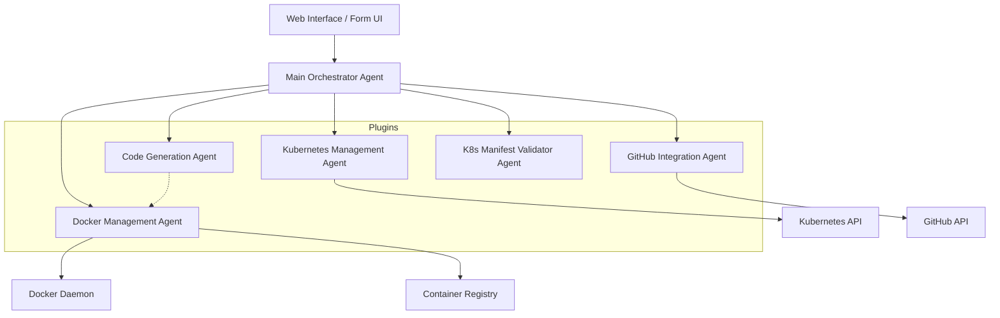

### High Level Design




### Plugin Architecture
KubeAgent follows a modular plugin-based architecture:

```
┌──────────────┐     ┌─────────────────┐
│   Web UI/    │     │      Main       │
│    CLI       │────▶│   Orchestrator  │
└──────────────┘     └────────┬────────┘
                              │
        ┌──────────────┬──────┴───────┬──────────────┐
        ▼              ▼              ▼              ▼
┌──────────────┐ ┌──────────────┐ ┌──────────────┐ ┌──────────────┐
│    Docker    │ │  Kubernetes  │ │     Code     │ │   Manifest   │
│    Plugin    │ │    Plugin    │ │   Generator  │ │  Validator   │
└──────────────┘ └──────────────┘ └──────────────┘ └──────────────┘
```
