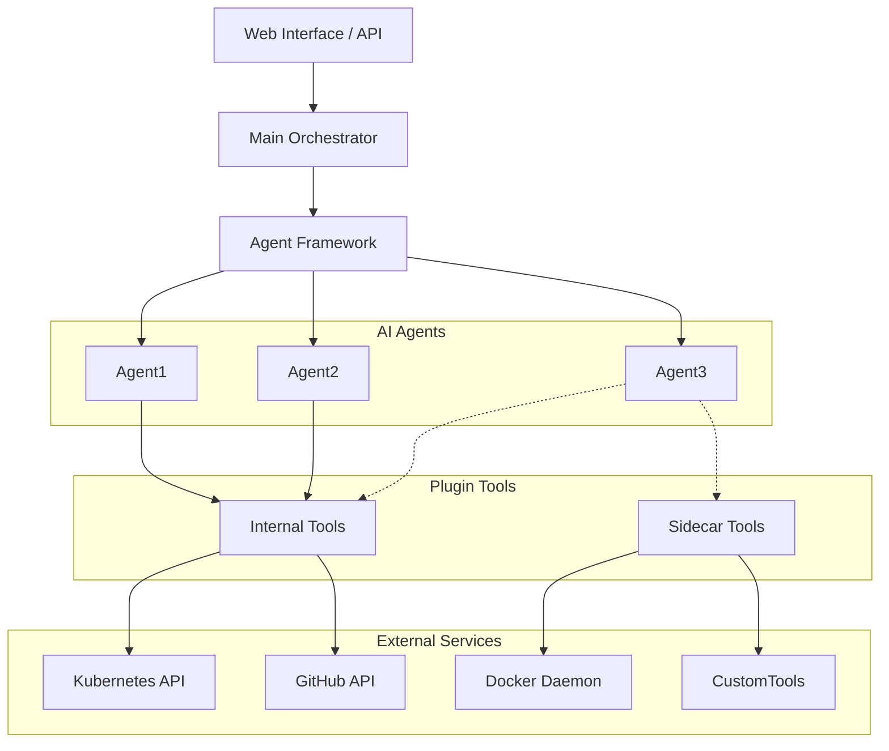

# KubeAgent Plugin Architecture

!https://img.shields.io/badge/License-MIT-yellow.svg

!https://img.shields.io/badge/python-3.11+-blue.svg

KubeAgent is an AI-powered orchestration system that simplifies Kubernetes service management through natural language interactions and automated workflows. It provides a dynamic agent-based architecture where each agent can be equipped with specialized tools for managing containers, deploying services, and generating application code.

## 🌟 Key Features

- **Natural Language Interface**: Interact with your Kubernetes cluster using plain English commands
- **Dynamic Agent Creation**: Create specialized AI agents through UI/API for different tasks
- **Customizable Agent Tools**: Equip agents with specific tools via plugin system
- **Automated Service Management**: Deploy and manage services with intelligent automation
- **Code Generation**: Generate FastAPI and Streamlit applications from descriptions
- **Plugin System**: Extensible tool system for enhancing agent capabilities
- **Local Development**: Built-in support for Minikube environments

## 🏗️ System Architecture

KubeAgent uses a hierarchical architecture combining AI agents with specialized tools:

### High-Level System Overview



## 🚀 Usage Examples

### 1. Creating an Agent with Tools

```yaml
# agent-config.yaml
name: kubernetes-deployment-agent
description: "Agent for handling Kubernetes deployments"
tools:
  - manifest-validator
  - deployment-manager
  - resource-monitor
properties:
  temperature: 0.7
  model: gpt-4

```

### 2. Natural Language Interactions

```bash
# Deploy a service using natural language
> Ask deployment-agent to "Deploy a Redis service with 3 replicas and persistent storage"

Agent: I'll help deploy the Redis service. I'll use the following tools:
1. Using manifest-validator to check configuration
2. Using deployment-manager to create resources
3. Using resource-monitor to verify deployment

[Progress updates follow...]

# Generate application code
> Ask code-agent to "Create a FastAPI service for user authentication with JWT"

Agent: I'll generate the authentication service:
1. Using code-generator to create FastAPI app
2. Using dependency-manager to set up requirements
3. Using test-generator to create unit tests

[Code generation progress follows...]

```

### 3. Custom Agent Creation via API

```python
# Example API request for creating a custom agent
POST /api/v1/agents

{
  "name": "custom-deployment-agent",
  "description": "Specialized agent for handling deployments",
  "tools": ["manifest-validator", "deployment-manager"],
  "properties": {
    "temperature": 0.7,
    "model": "gpt-4"
  }
}

```

### Custom Tools

Users can create custom tools as either:

- **Internal Tools**: Built into main application
- **Sidecar Tools**: Run as separate containers

## 📅 Roadmap

- [ ]  Project Setup & Core Infrastructure (Oct 24 - Oct 31, 2024)
- [ ]  Agent Framework Implementation (Nov 1 - Nov 7, 2024)
- [ ]  Basic UI & API Interface (Nov 7 - Nov 14, 2024)
- [ ]  Core Tools Development (Nov 14 - Dec 5, 2024)
- [ ]  Integration & Testing (Dec 5 - Dec 12, 2024)
- [ ]  Documentation & Release (Dec 12 - Dec 24, 2024)

Future Enhancements:

- Advanced agent collaboration patterns
- Custom tool marketplace
- Advanced monitoring and analytics
- Agent performance optimization
- Community tool sharing

## 📚 Documentation

- [Full Documentation](https://kubeagent.readthedocs.io/)
- [Agent Creation Guide](https://kubeagent.readthedocs.io/agents)
- [Tool Development](https://kubeagent.readthedocs.io/tools)
- [API Reference](https://kubeagent.readthedocs.io/api)

## 🤝 Contributing

We welcome contributions! See our [Contributing Guide](https://www.notion.so/CONTRIBUTING.md) for details.

## 📜 License

This project is licensed under the MIT License - see the [LICENSE](https://www.notion.so/LICENSE) file for details.

## 🙋‍♂️ Support

- 🐛 [Issue Tracker](https://github.com/yourusername/kubeagent/issues)
- 📧 [Email Support](mailto:support@kubeagent.io)

## 🌟 Acknowledgments

- OpenAI for LLM capabilities
- CrewAI framework contributors
- Kubernetes community
- All our contributors
